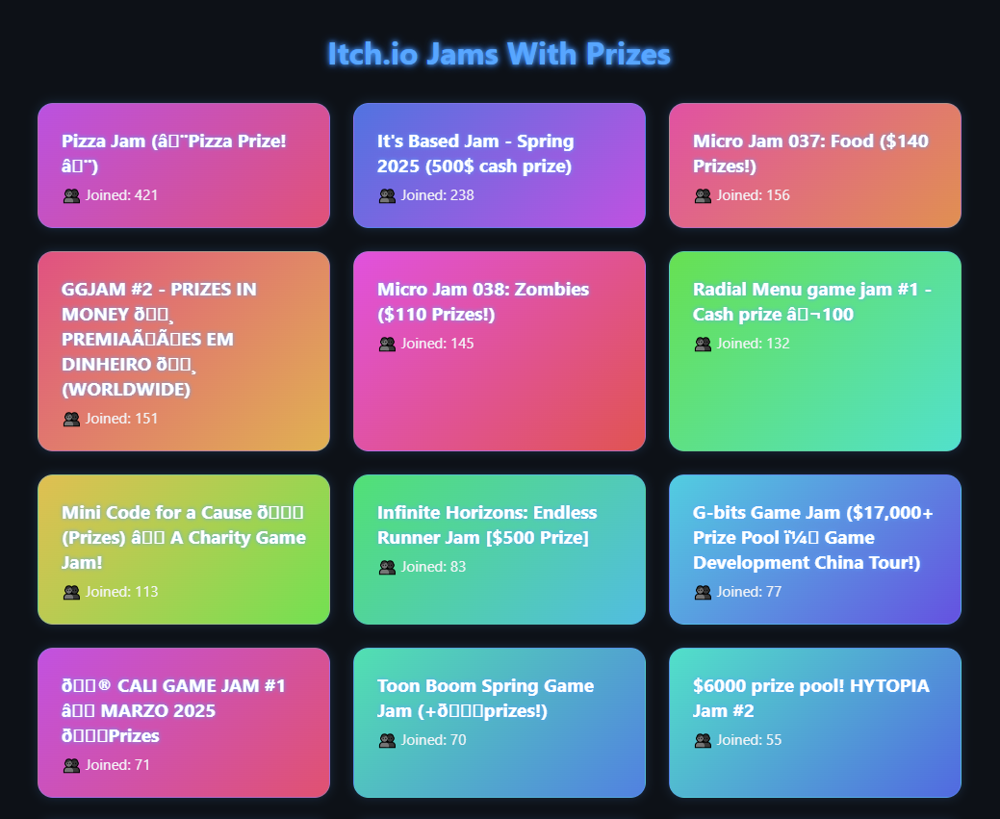

# 🎮 Itch.io Jam Scraper

A Python-powered GitHub Actions project that scrapes [itch.io](https://itch.io/jams) for **game jams with prize money** and publishes the results as a sleek, dark-themed GitHub Pages site.

> 🔗 **Live Demo:** [bakdavid.github.io/ItchScraper/](https://bakdavid.github.io/ItchScraper/)

## 🚀 Features

-   🕵️‍♂️ Automatically scrapes itch.io for jams with cash prizes
-   🧠 Filters duplicates intelligently
-   🌐 Hosts results on GitHub Pages
-   🌙 Dark mode, neon-styled cards
-   📦 Stores historical jam data in daily JSON files
-   🧰 Fully automated via GitHub Actions

## 📸 Preview



## 🛠 How It Works

1. **Python Scraper** runs daily via GitHub Actions:

    - Pulls jam data from itch.io
    - Detects mentions of prizes using keywords
    - Saves results as `data/YYYY-MM-DD.json`
    - Aggregates all JSONs into `data/index.json`

2. **Frontend (HTML/JS/CSS)** renders the data dynamically:
    - Displays unique jams as gradient-shaded cards
    - Hover effect adds a glowing neon vibe
    - Works directly in the browser via GitHub Pages

## 🧩 Folder Structure

```
├── archive/ # 10 day older archived files
│ └── 2025-04-22.json
├── data/ # Daily & aggregated JSON data
│ ├── 2025-04-22.json
│ └── index.json # Combined + deduplicated jam list
├── index.html # The landing page
├── script.js # JS to fetch & render the data
├── styles.css # Dark theme & neon glow styling
├── scraper.py # Python script for scraping jams
├── requirements.txt # Dependencies for python
├── preview.png # Preview image of the project
└── .github/workflows/daily.yml # GitHub Actions workflow
```

## 🧪 Local Development

To run locally:

```bash
# Install dependencies
pip install -r requirements.txt

# Run the scraper
python scraper.py

# Start a local HTTP server (optional, for viewing index.html)
python -m http.server
# Then open http://localhost:8000 in your browser
```

## 🛰 GitHub Pages Setup

1. Go to Settings → Pages

2. Select main branch and root as the source

3. Done! Your site is now live at `https://bakdavid.github.io/`

## 🧑‍💻 Built With

-   Python

-   BeautifulSoup

-   GitHub Actions

-   HTML/CSS/JS
